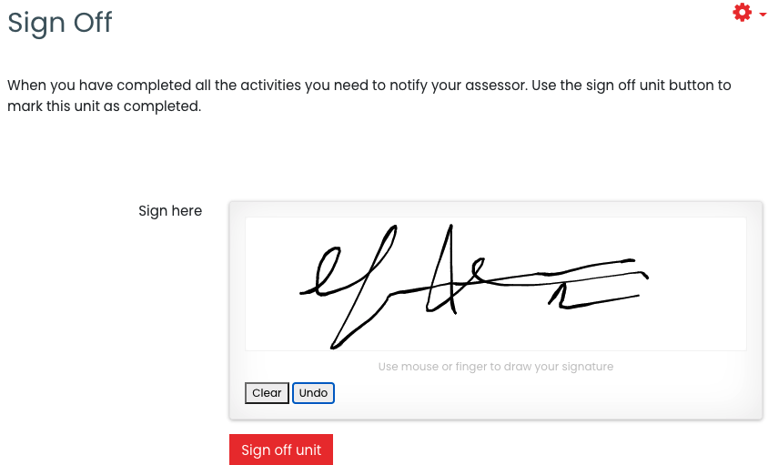
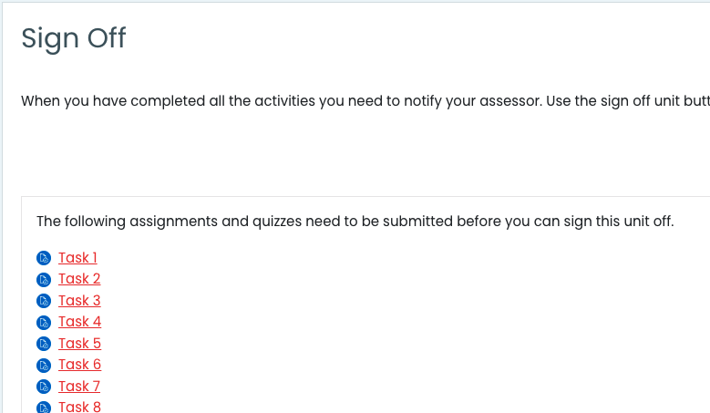

# mod_signoff

## Description

Notifies (via email) the teachers and optionally the learners when a button is pressed. You can change the text on the button. You would normally also use restriction requirements to ensure this activity is only accessible at the right time.

You can ask the user for a signature. They can sign this using their mouse or finger to draw they signature.

## Use cases

1) You have a course with multiple assignments and essay-style quizzes that require an assessor to mark only after the user has completed them all. But you don't want to bombard them with multiple notifications every time a learner completes each activity.

2) You want to take some formal acknowledgement from the user before releasing further content. You can complete the activity after the user signs and submits it, and use activity restrictions to limit further release based on this activities completin status.

## TODO

- [X] Option to list all assignments and quizzes that require submission
- [ ] Automatically submit all assignments in the section or course; can be emulated with activity restrictions
- [ ] Automatically trim the size of signature image to its minimum dimensions
- [ ] Use moodle file storage for signatures
- [ ] Get backup/restore working

### Copyright

This file is part of Moodle - http://moodle.org/

Moodle is free software: you can redistribute it and/or modify
it under the terms of the GNU General Public License as published by
the Free Software Foundation, either version 3 of the License, or
(at your option) any later version.

Moodle is distributed in the hope that it will be useful,
but WITHOUT ANY WARRANTY; without even the implied warranty of
MERCHANTABILITY or FITNESS FOR A PARTICULAR PURPOSE.  See the
GNU General Public License for more details.

You should have received a copy of the GNU General Public License
along with Moodle.  If not, see <http://www.gnu.org/licenses/>.

copyright 2021 tim st.clair <tim.stclair@gmail.com>
license   http://www.gnu.org/copyleft/gpl.html GNU GPL v3 or later
